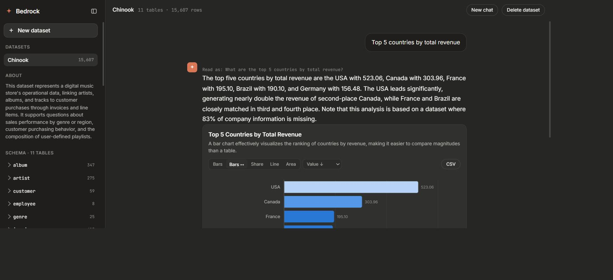
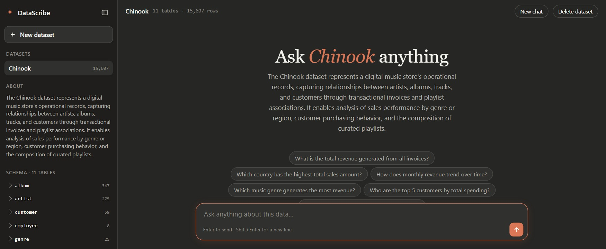
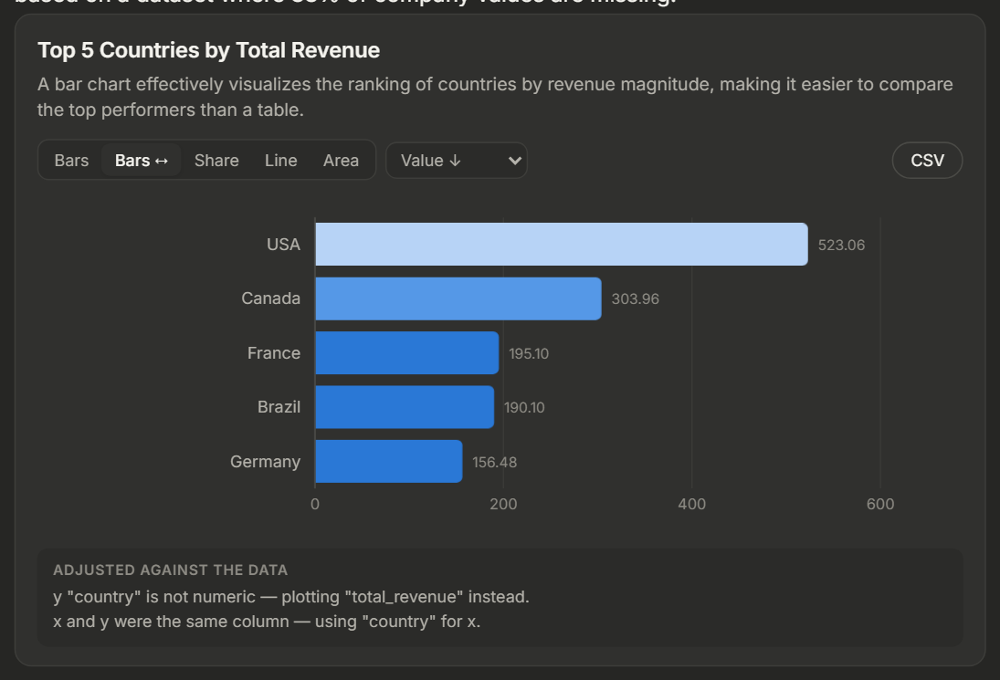
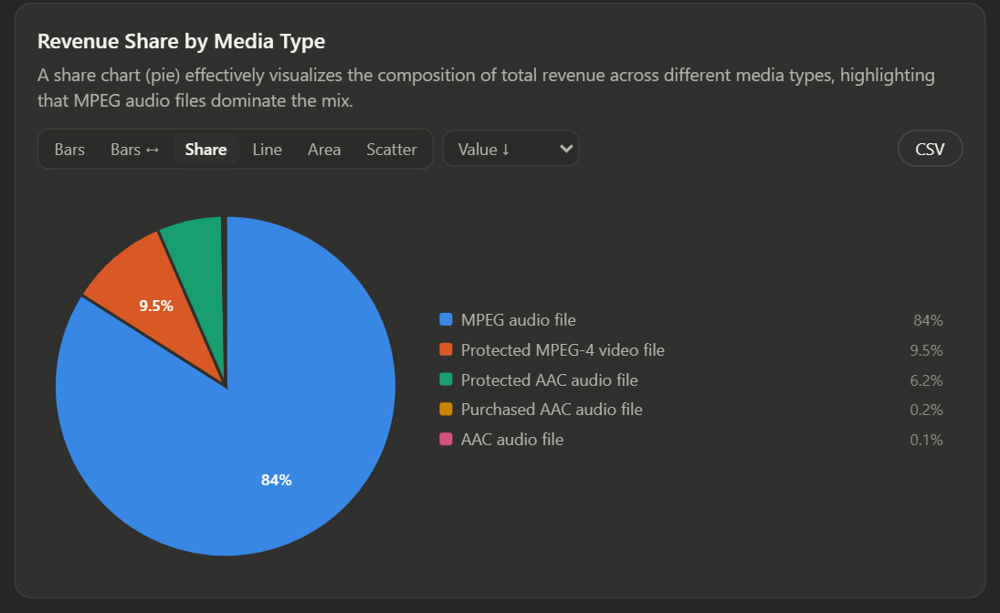
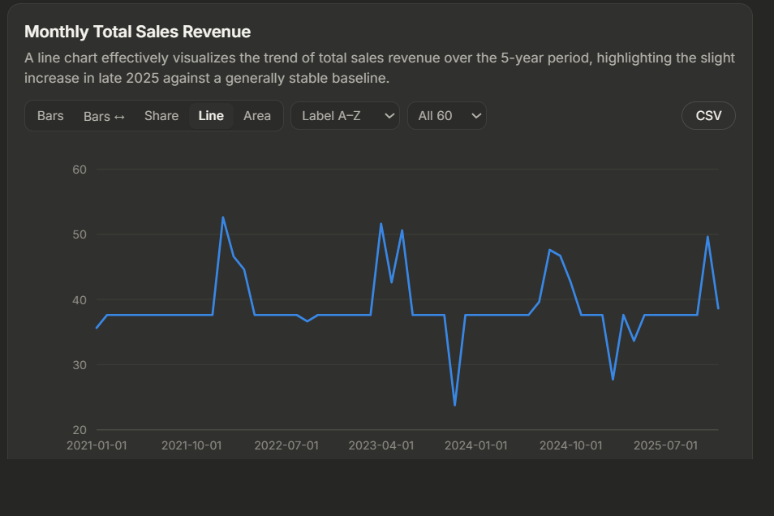
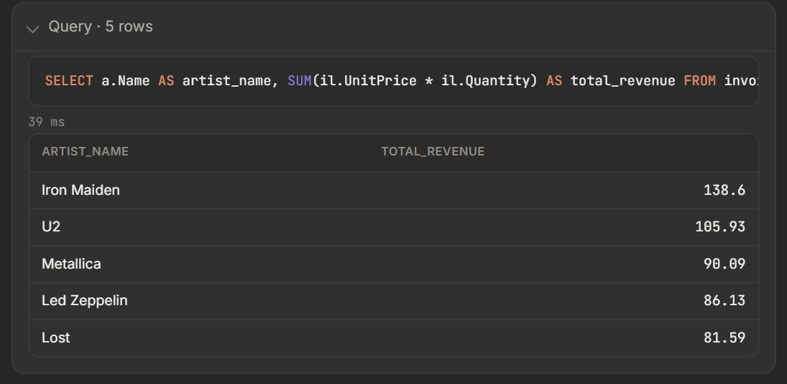
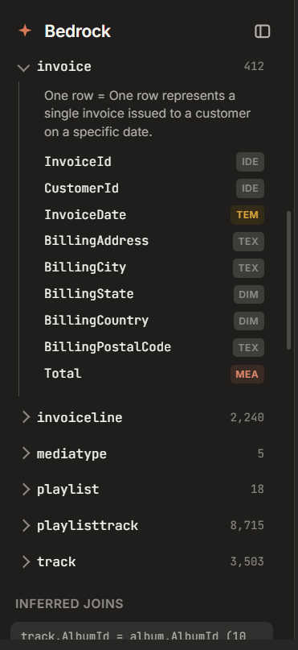
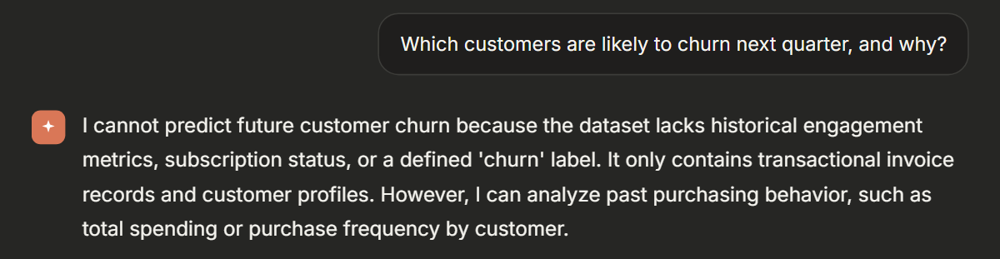

# DataScribe

**Upload a file. Talk to it. Get a chart back.**

DataScribe turns any spreadsheet, CSV or SQLite file into a DuckDB warehouse, works
out what the columns *mean* by measuring them, and then answers questions about
them in a conversation — with a chart beside the answer whenever a chart says it
better than a sentence.

There is **no bundled database and no hand-written data dictionary**. A dataset
exists only because someone uploaded it, and everything the agents know about it
was derived at upload time.



---

## Quickstart

```bash
git clone <this repo> && cd datascribe
pip install -r requirements.txt

cp .env.example .env     # then fill in the two model settings below
uvicorn server:app --reload
```

```ini
# .env
LLM_API_URL=http://127.0.0.1:1234   # LM Studio; Ollama 11434, llama.cpp 8080
LLM_MODEL=qwen/qwen3.5-9b           # optional — /v1/models is asked if unset
LLM_CONTEXT=46000                   # the window your server was STARTED with
LLM_REASONING_EFFORT=none           # see "Running on a small local model"
DATA_DIR=./data                     # where warehouses live        (optional)
MAX_UPLOAD_MB=512                   # per-upload ceiling           (optional)
```

Open <http://127.0.0.1:8000> and drop a file on the page. `GET /api/model` tells
you what the app is actually pointed at, which is the first thing to check when
a local server is involved.

> **The model.** DataScribe talks to any **OpenAI-compatible** `/v1/chat/completions`
> endpoint — LM Studio, llama.cpp, Ollama, vLLM, or a hosted one. No vendor SDK.
> It is built to run on a **small local model**: a 9B is the target, not the
> fallback. See [Running on a small local model](#running-on-a-small-local-model).
>
> Without a model configured you can still upload a file and browse everything the
> profiler derived; only the chat needs the LLM.

**The screenshots on this page are the [Chinook sample database][chinook]** — a
digital music store, 11 tables, 15,607 rows — dropped on the page as a single
`.sqlite` file. Grab it and you can reproduce every one of them.

[chinook]: https://github.com/lerocha/chinook-database

---

## What you get

### Drop a file and it explains itself

No canned examples: the opening questions are generated from the schema of the
file you just uploaded, and the summary in the rail is written from measured
statistics rather than guessed from the filename.



### Charts you can argue with

The visualization agent answers *"should this be a graph at all?"* before it picks
a form — a single total is a stat tile, a lookup is a table. Whatever it picks is
then reconciled against the actual result, and every override it had to make is
printed under the chart.



Every chart is live. The form switcher offers only the shapes *that* result can
support, and sort, top-N, series toggles and CSV export all re-render from the
same rows.

<table>
<tr>
<td width="50%"></td>
<td width="50%"></td>
</tr>
<tr>
<td><b>Share</b> — part-to-whole, every slice named with its percentage so the
small ones stay readable.</td>
<td><b>Line</b> — 60 months across a five-year window, labels thinned so they
never collide.</td>
</tr>
</table>

### The query behind every answer

Answers are prose, but the SQL and the rows it ran on are always one click away.



### A schema nobody wrote

Every table's **grain**, every column's **role**, the joins, and the data-quality
flags are measured at upload — not declared.



### It says no

Asked something the data cannot answer, DataScribe names what is missing and offers
what it *can* do, instead of inventing a definition and returning a confident
wrong number. This costs one model call and never touches SQL.



---

## How it works

```
upload ──► DuckDB warehouse ──► profiler ──► catalog (derived, not declared)
                                                │
message ──────────────────────────────────────► Router
        + the conversation so far                │
                                     ┌───────────┴───────────┐
                              "chat" │                       │ "data"
                            its reply IS               the message, rewritten
                             the answer                 to stand on its own
                                                              │
                                        SQL author ──► guard ──► EXPLAIN ──► execute
                                                          │         │
                                                          └─ SQL critic ◄┘ (bounded)
                                                              │
                                                         result rows
                                                     ┌────────┴────────┐
                                                Chart agent        Narrator
                                              (graph or not?)          │
                                                                   the reply
                                                                       │
                                                                    Suggest
```

Small talk costs **one** model call. A real question costs **four or five**. That
gap is the whole design: a chatbot that runs a SQL pipeline to reply to "thanks"
feels like a form, not a conversation.

| Agent | Sees | Decides |
|---|---|---|
| **Profiler** | the warehouse | what every column *is* |
| **Router** | message + conversation + whole schema | answer now, or restate the question and pick tables |
| **SQL author** | question + focused schema + last query | one DuckDB `SELECT` |
| **SQL critic** | the failed query + the exact error | the repair — bounded rounds, then it gives up honestly |
| **Chart agent** | question + result shape | **whether a graph belongs here**, then which one |
| **Narrator** | question + the rows that came back | the reply |
| **Suggest** | schema + what just ran | what to ask next |

### The Router is what makes it a conversation

One call that sees the schema, the last few exchanges and your newest message,
and does three things:

- **Routes it.** Does answering need the actual values, or does the schema already
  hold the answer? "Which genre earns most?" needs rows. "What's in this file?",
  "which columns are dates?", "thanks" do not.
- **Resolves the reference.** `and by category?` becomes *"What is the total
  revenue by category?"*. That rewritten question is what the SQL author, the
  chart title and the next-question chips all work from, and the UI shows it as
  *"Read as: …"* when it differs from what you typed.
- **Answers, when it can** — and it is forbidden from stating a figure, because
  it has seen the schema and never the values. If a number would answer the
  message, that message was a `data` message by definition.

---

## Any file becomes a DuckDB warehouse

| Upload | What happens |
|---|---|
| `.csv` `.tsv` `.txt` | typed auto-detect, retried as all-text if a dirty column would lose the file |
| `.xlsx` `.xlsm` `.xls` | one table per sheet; blank spacer columns and duplicate headers normalised |
| `.db` `.sqlite` `.sqlite3` | DuckDB's `sqlite_scanner`, falling back to stdlib `sqlite3` when offline |
| `.duckdb` `.ddb` | attached read-only and copied in, so we still own one file per dataset |
| `.parquet` `.pq` | `read_parquet` |
| `.json` `.jsonl` `.ndjson` | `read_json_auto` |

Upload several files at once and they land in the **same** warehouse — that is
what lets the profiler find the key that joins `orders.csv` to `customers.xlsx`.

### Queries cannot escape the file

`ingest()` is the only writer. Every query afterwards runs on a connection opened
`read_only=True` with `enable_external_access=false`, so model-authored SQL cannot
write, `ATTACH` another database, or read a path off the machine. On top of that
hard boundary sits a statement guard (single `SELECT`/`WITH`, comments and string
literals stripped before the keyword scan, so `WHERE status = 'refunded'` is
allowed and `-- ok\n; DELETE` is not), a 5,000-row cap, and a 30-second timeout
enforced through DuckDB's interrupt.

---

## The catalog replaces the dictionary

Nothing about a dataset is known ahead of time, so meaning is **derived** in two
passes at upload:

1. **Statistical, deterministic, no LLM.** Types, null rates, cardinality,
   uniqueness, ranges, real sample values, duplicate rows, Tukey-fence outliers,
   and join candidates found by *measuring value overlap* — a CSV has no foreign
   keys to trust.
2. **Semantic, one LLM call per table.** Those statistics go to the model, which
   writes each table's description and grain and a description per column. A
   final call writes the dataset summary.

Pass 1 is the ground truth; pass 2 is best-effort and per-table, so one awkward
table costs its own descriptions and nothing else.

The classifier is opinionated where statistics alone mislead: `customer_id` **and**
`CustomerId` are foreign keys even though they repeat and look numeric (never a
`SUM`); a unique `DOUBLE` like `price` in a 20-row table is a measure that happens
not to repeat; `signup_year` with three distinct values is a category encoded as a
number.

The catalog earns its keep twice more: the serious data-quality flags ride along
with the router's table choice into the SQL author's prompt, so a duplicate-rows
problem the statistics already proved does not have to be rediscovered; and the
opening chips on a fresh upload are generated from the schema.

---

## The chart agent decides *if*, not just *which*

"Should this be a graph?" is a real question with a real "no". The agent answers
`should_chart` first and picks a form second, and the UI shows its reasoning
either way — then shows the shape it *did* choose, because "no chart" is not the
same as "nothing to look at".

Whatever it returns is **reconciled against the data deterministically** in
`reconcile_chart()`, because a model will happily name a column that isn't in the
result. That pass repairs what it can, vetoes what it can't, and records every
override in `notes`:

- **wide results become multi-series.** Analytics tables routinely store periods
  as *columns* (`may_2025_gtv`, `jun_2025_gtv`), so "compare June to May by zone"
  comes back with the comparison spread across columns and no series dimension to
  point at. Every such column melts into a series at render time — if the agent
  names only one, the reconciler restores the rest rather than drawing half the
  answer.
- **columns on incompatible scales never share an axis.** A grouped bar of
  `jun_gtv` (7.6e9), `may_gtv` (3.1e9) and `gtv_pct_change` (0.06) renders the
  percentage as an invisible sliver and reads as "no change". The alternative — a
  second y-axis — is the single worst chart mistake there is, so the odd column is
  dropped and the reader is told.
- **`share` is refused over negative values.** A percentage of a total that
  crosses zero is not a real quantity, so the chart is redrawn as a bar, where a
  negative still means something.
- a `y` that isn't numeric is replaced with one that is, or the chart is vetoed
- one row × one measure is forced to a stat tile; zero rows to a table
- `line`/`area` moves onto a real date column when one came back — but a *text*
  month like `'2025-01'` with one row per label stays a line
- more than 30 categories ranks and keeps the top 30, and says so
- past 8 series the tail folds into "Other"; a scatter caps at 3; a share pie
  folds at 8 slices and shows at most 12 pies
- a diverging palette is downgraded to sequential when values never cross zero

Charts are dependency-free SVG on a palette validated for colour-vision deficiency
in both light and dark mode: thin marks, 4px rounded data-ends anchored to the
baseline, 2px surface gaps between stacked segments, a legend whenever there are
≥2 series, hover tooltips for the exact figure, and the full result table one
click away. **One number format is chosen per chart** from the axis extent, so a
tall bar reading `498.2k` never sits beside a short one reading `35,310.75`, and
labels printed on a fill take their ink from that fill's luminance.

---

## Running on a small local model

A 9B model is not a small frontier model; it fails in its own specific ways, and
all of them are cheaper to engineer around than to prompt around. Everything
here is measured against `qwen/qwen3.5-9b` in LM Studio.

**It thinks the budget away.** A Qwen3-class model emits a reasoning block
before its answer and bills it to the same `max_tokens` as the answer. Ask it
for a two-field routing decision in 700 tokens and it returns
`finish_reason: "length"` with an *empty* `content` — 700 tokens of reasoning,
no reply. Downstream that surfaced as `RuntimeError: model did not return valid
JSON: no JSON object in model reply`, which is true and useless: there was no
reply to find JSON in. Three fixes, all in `llm.py`:

- `reasoning_effort` is sent on every call (`LLM_REASONING_EFFORT`, default
  `none`). On this workload `low` spent 400–2500 tokens and ~30s per call to
  arrive at the same JSON `none` reaches in 3s.
- the generation cap is no longer the caller's context reserve. Those are
  different numbers — the reserve is how much room the *answer* needs,
  `max_tokens` also has to cover whatever the model thinks first — so it is
  floored at `LLM_MIN_OUTPUT` and capped at `LLM_MAX_OUTPUT`.
- a truncated reply is retried with **twice** the room, not re-asked at the same
  size. Re-asking is how one failure becomes three.

**It writes JSON by hand, badly.** Raw newlines inside a string (a formatted
multi-line `SELECT` is the usual culprit), trailing commas, ```json fences,
"Here is the JSON:", Python `True`/`None`. So the server is asked to constrain
decoding to the schema — `response_format: json_schema` — which makes invalid
JSON unrepresentable rather than unlikely. Where that is unavailable the reply
is repaired (control characters escaped, brackets closed, literals fixed) and
then, failing that, salvaged field by field; a bare ```sql fence with no wrapper
around it still yields a query. Capabilities are probed by use: a server that
rejects `response_format`, `reasoning_effort` or `model` has that feature turned
off for the rest of the process and the call retried, so a plain endpoint with
none of them still works.

**Constrained decoding makes it dumber.** This one is easy to miss. With a
grammar forcing the first token to be `{"sql":`, the model has to start
answering before it has worked anything out, and the SQL gets worse — asked to
compare June to May it reached for a `LAG` window function over the wrong
partition. Given the *same* schema with `explanation` declared first, it wrote
the `CASE WHEN` pivot the question actually wanted. So the schemas in
`agents.py` declare their rationale field first, and the model reasons inside
its own JSON. Field order is load-bearing; do not tidy it.

**It does not know DuckDB.** It knows "SQL", then reaches for a Postgres or
Spark function that does not exist here — and the repair loop spends its entire
budget re-inventing the same missing function, because the critic only ever saw
the newest failure. `DUCKDB_NOTES` names the handful it actually gets wrong
(`UNNEST(STRING_SPLIT(...))`, `QUALIFY`, `STRFTIME`, `TRY_CAST`), and the critic
is now shown every dead end so far and told not to return to one.

**It fumbles transcription.** Handed a cell reading `69.62` it will write
"6,962%" — a wrong number, stated with complete confidence, which is the one
failure this app cannot ship. Every figure in the narrator's reply is now
checked against the cells it was shown (`ungrounded_figures()`); a figure that
is in no cell buys one bounded rewrite naming the offending number, and if the
second draft is no better the reply says so rather than passing it off as
checked.

The result on the sample dataset: small talk one call and ~1.6s, a full data
turn five calls and ~6-8s, and no JSON parse failures.

### Tuning

| Setting | Default | Raise it when |
| --- | --- | --- |
| `LLM_CONTEXT` | 16000 | your server holds more — this is what sizes every prompt, so a low value silently degrades the schema the router sees |
| `LLM_MIN_OUTPUT` | 1024 | replies come back truncated |
| `LLM_MAX_OUTPUT` | 4096 | a wide table's description needs more |
| `LLM_REASONING_EFFORT` | `none` | you have latency to spare and want a second opinion on hard SQL |
| `LLM_DESCRIBE_WORKERS` | 2 | your server really does serve requests in parallel |

## Context budgeting

An uploaded workbook can carry forty tables and three hundred columns, which does
not fit a 16k window alongside a system prompt and room to answer. Every call is
sized before it is sent:

```
input_allowance = max_context − reserved_output − safety_margin
```

Three fitting strategies in `context.py`, one per shape:

- **`fit_schema()`** — the router needs *breadth*, so tables degrade in detail
  (full → columns only → name + row count) rather than disappearing. The router
  cannot choose a table it was never shown.
- **`focus_schema()`** — the SQL author needs *depth* on the router's few chosen
  tables; everything else is dropped.
- **`fit_rows()`** — an ordered result carries meaning at both ends (top sellers
  *and* worst performers), so head and tail survive and the middle is elided.

---

## API

```
POST   /api/datasets              multipart upload → ingest + profile
GET    /api/datasets              list uploaded datasets
GET    /api/datasets/{id}         derived catalog + opening questions
GET    /api/datasets/{id}/preview sample rows for one table
GET    /api/datasets/{id}/export  guarded CSV export of a result
DELETE /api/datasets/{id}         remove the warehouse and the originals
POST   /api/chat                  one turn, streamed back as NDJSON
```

`/api/chat` takes `{dataset, message, history[]}` and streams newline-delimited
JSON events — `route`, `sql`, `result`, `answer`, `chart`, `suggestions` — which is
what lets the UI fill a turn in as it happens. The conversation lives in the
browser and rides along with each request, so the server keeps no session: a
restart loses nothing and two tabs cannot tread on each other.

The export endpoint runs the same guard the agents do: its `sql` parameter is
user-supplied and is not trusted.

## Files

```
warehouse.py     upload → DuckDB; guarded, capped, timed read-only execution
profiler.py      statistical + semantic catalog — this is what replaces the dictionary
models.py        dataclasses (Catalog, Exchange, Route, QueryResult, ChartSpec, TurnResult)
context.py       token budgeting: fit_schema / focus_schema / fit_rows
llm.py           OpenAI-compatible client: constrained decoding, JSON repair/salvage,
                 reasoning-budget control, capability probing
agents.py        router, SQL author, SQL critic, chart, narrator, suggest + reconcile_chart()
orchestrator.py  one chat turn, streaming every step as an event
server.py        FastAPI: upload, catalog, preview, CSV export, streamed chat
index.html       the chat: dropzone, schema rail, live SVG charts, query disclosure
```

## Known limits

- **Only the *presence* of a figure is verified, not its claim.** Every number in
  the reply is checked against the cells the narrator was shown, so an invented
  figure is caught. Which column it belongs to is not — the wide-result trap is
  quoting June's number in May's clause, and both numbers are real. That part is
  still a prompt, not a proof; an isolated checker per claim is what would make
  it a guarantee.
- Heuristic token counting; swap `estimate_tokens()` for a real tokenizer for
  tighter packing.
- The join scan probes at most 40 column pairs, name-matched first, so a very wide
  multi-file upload may miss an unnamed key.
- Duplicate-row and exact-distinct checks fall back to approximations past
  500k / 300k rows to keep profiling interactive.
- The conversation is per-tab and in-memory: a reload starts a fresh thread.
- No eval harness yet. A frozen question set scored on execution accuracy would
  let you prove a prompt change helped instead of guessing.
